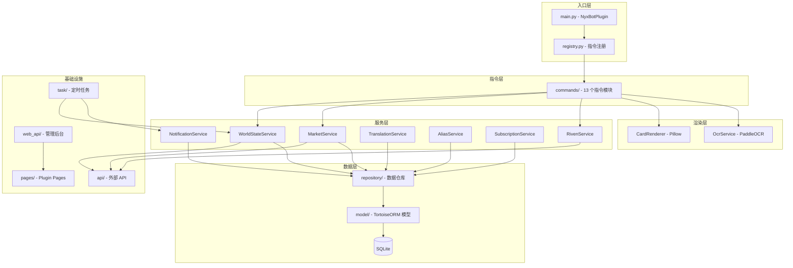

<div align="center">


# NyxBot

AstrBot 的 Warframe 助手插件，提供世界状态查询、市场交易、紫卡分析、订阅通知等功能。

[](https://github.com/AstrBotDevs/AstrBot)
[](https://www.python.org/)
[](LICENSE)

</div>

---

## 功能概览

| 模块 | 说明 |
|------|------|
| 🌍 **世界状态** | 查询警报、突击、裂隙、入侵、平原周期、虚空商人、仲裁、双衍王境等实时数据 |
| 💰 **市场交易** | 对接 Warframe.Market API，查询物品订单、拍卖行情 |
| 🔮 **紫卡分析** | 紫卡倾向计算、价格估算、属性分析 |
| 📢 **订阅通知** | 群组任务订阅，定时推送世界状态变更通知 |
| 🔍 **OCR 识别** | 基于 PaddleOCR PP-OCRv5 的文字识别，支持游戏截图解析 |
| 🌐 **中英翻译** | Warframe 物品/状态中英文名称互查 |
| ⚙️ **数据管理** | Plugin Pages 管理后台，支持别名、翻译、紫卡等数据的可视化 CRUD |

---

## 指令列表

插件支持通过 `wf_command_prefix` 配置项自定义指令前缀：

- **前缀非空时**（如设为 `wf`）：指令以 `/wf help` 形式触发
- **前缀为空时**（默认）：指令以 `/help` 形式触发，无需前缀

| 指令 | 说明 | 状态 |
|------|------|------|
| `help` | 显示 Warframe 助手指令帮助 | ✅ 已实现 |
| `平原` | 查看平原周期（希图斯、金星、扎里曼） | 🚧 开发中 |
| `警报` | 查看当前警报任务 | 🚧 开发中 |
| `突击` | 查看今日突击任务 | 🚧 开发中 |
| `裂隙` | 查看当前虚空裂隙 | 🚧 开发中 |
| `入侵` | 查看当前入侵任务 | 🚧 开发中 |
| `奸商` | 查看虚空商人（Baro Ki'Teer） | 🚧 开发中 |
| `仲裁` | 查看当前仲裁任务 | 🚧 开发中 |
| `双衍` | 查看双衍王境周期 | 🚧 开发中 |
| `每日特惠` | 查看达尔沃每日特惠商品 | 🚧 开发中 |
| `钢铁` | 查看钢铁之路轮换与精华 | 🚧 开发中 |
| `电波` | 查看午夜电波任务与奖励 | 🚧 开发中 |
| `遗物` | 查看当前遗物掉落 | 🚧 开发中 |

---

## 架构



---

## 安装

### 方式一：管理面板安装

在 AstrBot 管理面板的插件市场中搜索 `nyxbot` 安装。

### 方式二：手动安装

将此仓库克隆到 AstrBot 的 `data/plugins/` 目录下：

```bash
cd AstrBot/data/plugins
git clone https://github.com/KingPrimes/astrbot_plugin_nyxbot.git
```

---

## 配置

插件安装后，在 AstrBot 管理面板的插件配置中可设置以下选项：

| 配置项 | 说明 | 类型 | 默认值 |
|--------|------|------|--------|
| `wf_update_interval` | 世界状态更新间隔（秒），建议不低于 60 | `int` | `600` |
| `wf_notification_retention_hours` | 通知历史保留时长（小时），超时自动清理 | `int` | `12` |
| `wf_data_source_cdn` | 数据源 CDN 地址（翻译/别名等静态数据） | `string` | `https://testingcf.jsdelivr.net/gh/KingPrimes/DataSource` |
| `wf_arbitration_data` | 仲裁数据源 URL，需返回 JSON 格式 | `string` | `` |
| `wf_command_prefix` | 指令前缀，为空则无需前缀 | `string` | `""`（空） |
| `db_debug` | 数据库调试日志，开启后输出 SQL 查询日志 | `bool` | `false` |

### 数据源 CDN 可选项

- `https://testingcf.jsdelivr.net/gh/KingPrimes/DataSource`
- `https://jsd.onmicrosoft.cn/gh/KingPrimes/DataSource`
- `https://cdn.jsdelivr.net/gh/KingPrimes/DataSource`
- `https://kingprimes.top`

---

## 项目结构

```
astrbot_plugin_nyxbot/
├── main.py                    # 插件入口（NyxBotPlugin 类）
├── registry.py                # 指令注册与模块路径修补
├── _conf_schema.json          # 插件配置 Schema
├── metadata.yaml              # 插件元数据
├── pyproject.toml             # 项目配置与依赖管理
├── requirements.txt           # Python 依赖
├── logo.png                   # 插件图标
├── LICENSE                    # 开源协议
├── pages/
│   └── nyxbot-admin/          # Plugin Pages 管理后台前端
│       └── assets/            # 前端静态资源
├── src/
│   ├── api/                   # 外部 API 封装（Warframe.Market、世界状态）
│   ├── commands/              # 指令模块（13 个指令文件）
│   ├── config/                # 配置管理
│   ├── init/                  # 数据初始化（别名、节点、紫卡等）
│   ├── model/                 # 数据模型（TortoiseORM，20+ 模型）
│   │   └── export/            # 导出数据模型（战甲、武器、遗物等）
│   ├── ocr/                   # PaddleOCR 文字识别服务
│   ├── render/                # Pillow 卡片渲染引擎
│   │   ├── fonts/             # 字体文件
│   │   ├── styles/            # 样式定义
│   │   └── templates/         # 卡片模板
│   ├── repository/            # 数据仓库层（CRUD 封装）
│   ├── service/               # 业务服务层
│   ├── task/                  # 定时任务（WorldState 拉取与通知）
│   ├── util/                  # 工具函数（缓存、HTTP、时间、字符串）
│   ├── web_api/               # 数据管理后台 API（Plugin Pages 后端）
│   └── wenum/                 # 枚举定义（派系、裂隙类型、任务类型等）
└── tests/                     # 单元测试
```

---

## 技术栈

| 类别 | 技术 | 说明 |
|------|------|------|
| 框架 | [AstrBot](https://github.com/AstrBotDevs/AstrBot) | 插件框架（`>=4.23.5`） |
| 数据库 | TortoiseORM + SQLite | 异步 ORM，本地 SQLite 存储 |
| 渲染 | Pillow | 信息卡片直接绘制，无需浏览器 |
| OCR | PaddleOCR PP-OCRv5 | CPU 推理，中英文文字识别 |
| 调度 | apscheduler | 定时任务调度 |
| 网络 | aiohttp / httpx | 异步 HTTP 客户端 |
| 序列化 | orjson / pydantic | 高性能 JSON 解析与数据校验 |
| 缓存 | cachetools | 内存缓存（TTL 策略） |

---

## 开发

### 代码风格

| 规则 | 说明 |
|------|------|
| **Python 版本** | `>=3.12` |
| **Linter** | `ruff>=0.9.0` |
| **测试** | `pytest>=8.0.0` + `pytest-asyncio>=0.25.0` |
| **类型注解** | 所有函数使用完整类型标注，文件头必须包含 `from __future__ import annotations` |
| **文档字符串** | 中英双语 docstring，描述模块/类/方法的功能 |
| **异步** | 所有 Handler 和服务方法均为 `async` |
| **导入** | 使用相对导入（如 `from ...registry import wf`） |
| **结果返回** | 使用 `yield event.plain_result()` 返回文本，`yield event.chain_result()` 返回图片 |

### 添加新指令

1. 在 [`src/commands/`](src/commands/) 目录下创建新的指令文件（如 `wf_plain.py`）
2. 使用 [`registry.py`](registry.py) 提供的 `wf` 装饰器注册指令：

```python
"""wf_plain - /plain or /平原 - 查看平原周期"""
from __future__ import annotations

from astrbot.api.event import AstrMessageEvent
import astrbot.api.message_components as Comp

from ...registry import wf
from ..service.world_state import WorldStateService
from ..render.card_renderer import CardRenderer


@wf.command("平原")
async def wf_plain(self, event: AstrMessageEvent):
    """查看平原周期"""
    # 1. 从服务层获取数据
    data = await WorldStateService.get_cetus_cycle()

    if not data:
        yield event.plain_result("暂无数据")
        return

    # 2. 渲染为卡片图片
    renderer = CardRenderer()
    img = renderer.create_cycle_card(data)
    img_bytes = CardRenderer.render_to_bytes(img)

    # 3. 返回图片结果
    yield event.chain_result([Comp.Image.fromBytes(img_bytes)])
```

3. 在 [`src/commands/__init__.py`](src/commands/__init__.py) 的 `register_all()` 中导入新模块：

```python
from . import wf_plain  # noqa: F401
```

> **注意**：[`registry.py`](registry.py) 会自动修补 Handler 的 `__module__`，确保 AstrBot 插件管理器能正确发现独立文件中定义的 Handler。

---

## 许可证

详见 [LICENSE](LICENSE) 文件。
